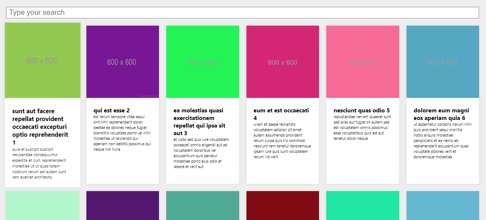
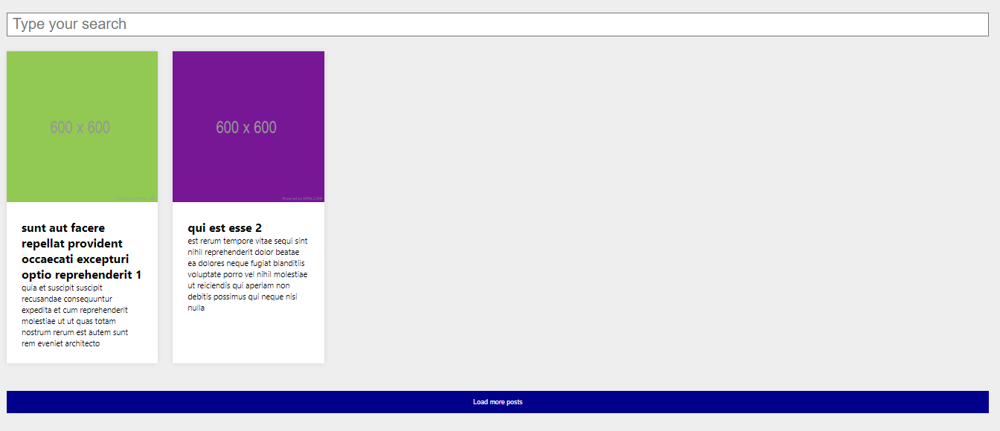
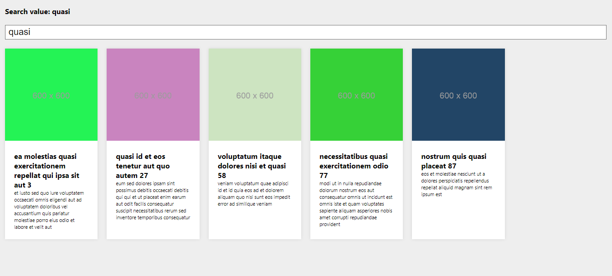
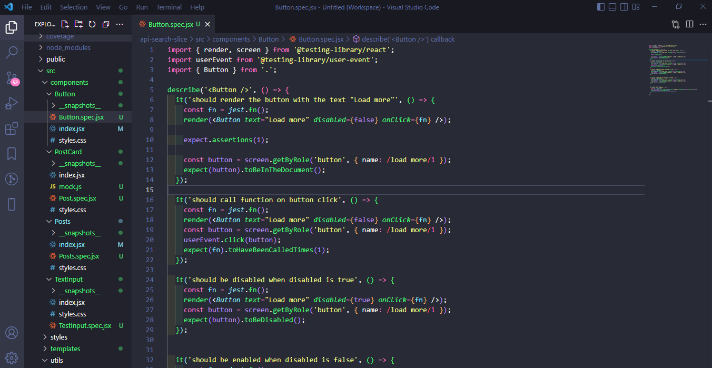

 

  <h1>Bem Vindos(as)!!</h1>
  <strong>Ligação a api com search, view more e test</strong>

 

    

## ✌️ Ligação a api com search, view more e test
<strong> Estudos direcionados a testes, criei uma ligação a api de posts com imagem, título e texto, com barra de pesquisa, botão para ver mais posts, o mesmo desativa ao usar a barra de pesquisa e quando finaliza a quantidade de posts ele bloqueia, os testes foram direcionados a cada componente, para validação utilizei o props-types.

### 🎨 Frontend

*  **Frontend**: ReactJS, com Visual Studio Code 

## 🙌 Quer Contribuir?

Que tal:
* 🤔 Sugira um recurso
* 🐛 Informar um problema
* 📖 Melhore a documentação
* 👨‍💻 Contribua com o código

Você é mais que bem vindo! 

Obs: Todos os textos e imagens atuais são ficticios, projeto não concluso.

    <h6>Feito com ❤️ by DebsLorena</h6>
    <a href="https://www.linkedin.com/in/loredebs/"><strong>Linkedin</strong></a> 
    <a href="https://www.instagram.com/debslorena/"><strong>Instagram</strong></a>

